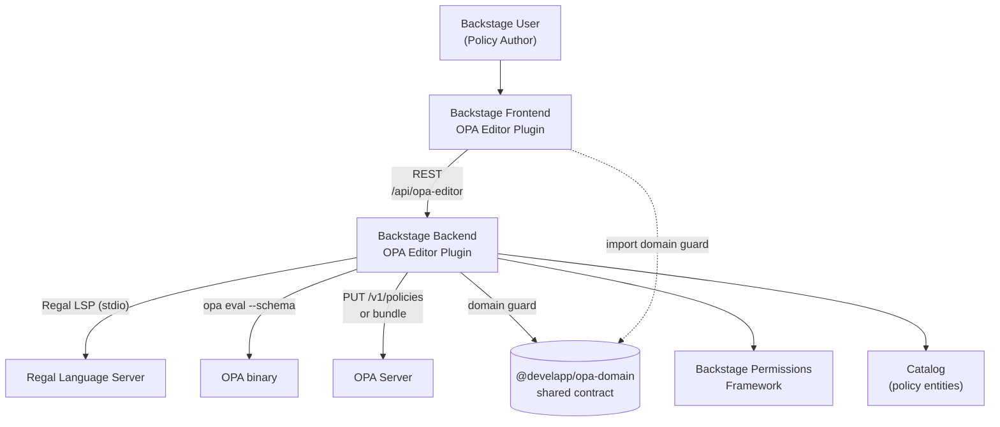
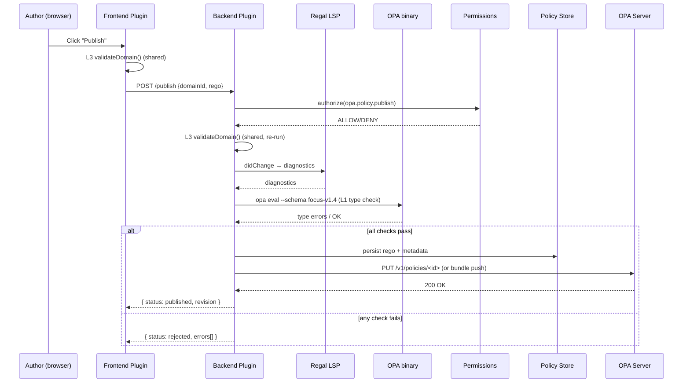

# Domain-Scoped OPA Rego Editor for Backstage
## Technical Design Specification

**Author:** Vibe Deep Research
**Status:** Draft for review
**Date:** 2026-09-14
**Scope target domain (illustrative):** FinOps cost modeling (FOCUS-aligned)

---

## 1. Question / Objective

Design a **Backstage plugin** that lets users author Open Policy Agent (OPA) **Rego** policies inside an in-portal editor, where the editor is **scoped to a specific domain** (e.g. FinOps cost modeling). Scoping is expressed as a **JSON Schema** that constrains the Rego input document and the allowed policy surface. The same domain-checking logic must run **in the frontend** (live, while typing) and **in the backend** (authoritative, before persistence/distribution). On submit, the Rego is transmitted to the server and persisted/distributed to an OPA instance using the same domain contract on both sides.

Non-goals (this revision): multi-file bundle orchestration, GitOps PR workflows beyond a hook, and runtime decision enforcement in Backstage itself.

---

## 2. Executive Summary

1. **Domain scoping = JSON Schema bound to the Rego `input`.** OPA already supports JSON Schema-based type checking via the `--schema` flag and `METADATA` `schemas` annotations. We reuse this exact mechanism as the single source of truth for "what a FinOps policy may reference."
2. **One shared domain contract, two enforcement points.** The JSON Schema (and a small TypeScript "domain guard" derived from it) is published as a shared package consumed by both the frontend editor and the backend validator, so frontend and backend use identical domain checking.
3. **Frontend editor = Monaco + a thin Rego language client.** Monaco is the React-friendly code editor that powers VS Code; the Rego experience (diagnostics, formatting, completion) comes from **Regal**, the Rego LSP. In-browser we run a lightweight client that gets diagnostics from the backend LSP bridge rather than a browser-side Rego binary.
4. **Backend = a Backstage backend plugin** exposing `/validate`, `/publish`, and `/evaluate`. It runs the canonical checks (Regal linter + OPA `opa eval --schema` type check + the domain guard), then persists Rego and pushes it to OPA via the **OPA REST API** (`PUT /v1/policies/<id>`) or a bundle server.
5. **Backstage-native integration:** permissions framework gates who may publish; the proxy plugin fronts the OPA server; the scaffolder can ingest generated policies; the catalog can model OPA policies as resources.
6. **FinOps example is concrete:** the FinOps Foundation's **FOCUS** specification already has a published JSON Schema (community `finops-focus-schema`), giving a ready-made domain schema for the FinOps cost-modeling scope.

---

## 3. Methodology

This spec was built from public primary sources: the OPA documentation (policy language, schemas/type-checking, REST API, bundles), the Regal language-server documentation, the Backstage documentation (frontend/backend plugin architecture, permissions framework, proxying), and the FinOps Foundation FOCUS specification plus its community JSON Schema. Internal/private DevelApp context was not consulted; all wiring assumes standard self-hosted Backstage (React frontend + Node backend). Limitations: OPA's LSP evaluation code-lens feature is currently implemented only in the OPA VS Code extension and Neovim clients, so in-browser "click to evaluate" must be implemented as a backend endpoint rather than a pure LSP code lens.

---

## 4. Architecture Overview

### 4.1 System context



### 4.2 The "same domain checking" principle

The core design invariant is that **frontend and backend never disagree** about whether a Rego module conforms to the domain. This is achieved three ways, layered so a failure at any layer is caught:

| Layer | Mechanism | Where it runs | Purpose |
|---|---|---|---|
| L1 — Schema type check | OPA `opa eval --schema <domain.json>` (and `METADATA` `schemas` annotation in the Rego) | Backend (authoritative) + reused as lint source for frontend | Static type checking of Rego against the input JSON Schema |
| L2 — Lint | Regal linter (LSP diagnostics) | Backend LSP bridge → frontend | Syntax, style, and structural Rego errors |
| L3 — Domain guard | TypeScript `validateDomain(rego, schema)` from the shared package | Frontend (live) + Backend (before publish) | Domain-specific structural rules beyond what JSON Schema type-checking expresses (e.g. "must define `package finops.costmodel.*`", "must export `allow`/`deny`/`report`") |

L1 and L3 use the **same JSON Schema file** as input. L3 also exposes the schema so the editor can offer completion/snippets from the schema fields.

---

## 5. Domain Schema — the scoping mechanism

### 5.1 Why JSON Schema is the right boundary

OPA accepts arbitrary structured data as input and Rego/OPA are domain-agnostic. OPA added **JSON Schema-based type checking** so Rego's gradual type system can reason about the intended shape of `input`, catching authoring mistakes earlier. The schema is supplied with the `--schema`/`-s` flag to `opa eval`, and/or declared in-policy via a `METADATA` block:

```rego
# METADATA
# schemas:
#   - input: schema["finops-focus"]
package finops.costmodel.allow

default allow := false

allow if {
  input.BillingCurrency == "USD"
  input.ServiceName == "AWS EC2"
  input.EffectiveCost > 1000
}
```

This makes the JSON Schema the natural, native way to scope the editor to a domain: the schema **is** the domain.

### 5.2 Domain package layout

A domain is published as a versioned package so frontend and backend import the same artifact:

```
packages/plugins/opa-domain-finops/
  src/
    schemas/
      focus-v1.4.json          # the domain input schema (FOCUS columns)
    domain-guard.ts            # validateDomain(): structural rules + schema load
    snippets.ts                # Monaco snippet templates for this domain
    index.ts                   # exports the DomainDescriptor
```

A `DomainDescriptor` is the contract every domain package implements:

```typescript
export interface DomainDescriptor {
  id: string;                 // "finops.costmodel"
  title: string;              // "FinOps Cost Modeling (FOCUS)"
  inputSchemaUri: string;     // resolves to schemas/focus-v1.4.json
  requiredPackagePrefix: string;     // e.g. "finops.costmodel"
  requiredRules: string[];    // e.g. ["allow", "deny", "report"]
  allowedDataRefs: RegExp;    // constrains `data.*` references
  snippets: RegoSnippet[];
  validateDomain(rego: string): DomainValidationResult;
}
```

### 5.3 FinOps example: FOCUS as the domain schema

The FinOps Foundation maintains **FOCUS** (FinOps Open Cost and Usage Specification), an open standard defining a common data schema, controlled column vocabulary, allowed values, and pricing attributes for normalized cost/usage data. A community project (`openmeterio/finops-focus-schema`) publishes **JSON Schema for FOCUS**. For the FinOps domain scope, `focus-v1.4.json` is derived from that schema and used as the Rego `input` schema — so every policy the editor accepts is statically checked against FOCUS column names like `BillingCurrency`, `ServiceName`, `EffectiveCost`, `ChargePeriodStart`, etc.

---

## 6. Frontend Plugin — the OPA Editor

### 6.1 Package structure (Backstage frontend plugin)

```
packages/plugins/opa-editor/
  src/
    components/OpaEditorPage.tsx     # page extension (blueprint)
    components/RegoEditor.tsx        # Monaco wrapper
    components/DomainPicker.tsx      # selects DomainDescriptor
    components/DiagnosticsPanel.tsx # L1+L2+L3 results
    api/OpaEditorApiClient.ts       # Utility API → backend
    api/domainRegistry.ts          # loads DomainDescriptor packages
    index.ts
```

The plugin is registered with `createFrontendPlugin` and contributes a page via a `PageBlueprint` (Backstage's new frontend system) and optionally entity-page cards for catalog-modeled policies.

### 6.2 Monaco as the editor kernel

Monaco is the editor engine that powers VS Code and is the most capable React-friendly code editor (`@monaco-editor/react` embeds it without webpack config). For Rego we register a `rego` language and provide:

- **Monarch tokenizer** for Rego syntax highlighting (a compact token definition; full grammar lives in Regal).
- **Snippets** sourced from the active `DomainDescriptor.snippets` (e.g. "deny expensive service", "aggregate effective cost by service").
- **Schema-driven completion** — a completion provider that introspects the domain JSON Schema and offers `input.<column>` completions, so authors discover FOCUS fields instead of guessing them.
- **Diagnostics** — Monaco markers populated from the backend LSP bridge (see §7.2).

```typescript
// RegoEditor.tsx (illustrative)
import { Editor } from '@monaco-editor/react';
import { useApi } from '@backstage/core-plugin-api';
import { opaEditorApiRef } from '../api';

export const RegoEditor = ({ domainId, value, onChange }: Props) => {
  const api = useApi(opaEditorApiRef);
  const domain = useDomain(domainId);

  const onMount = async (editor, monaco) => {
    monaco.languages.registerCompletionItemProvider('rego', {
      triggerCharacters: ['.'],
      provideCompletionItems: async (model, position) => {
        const word = model.getWordUntilPosition(position);
        const schemaFields = domain.inputSchemaFields(); // from JSON Schema
        return { suggestions: schemaFields.map(toCompletion(word)) };
      },
    });
  };

  const options = { minimap: { enabled: false }, automaticLayout: true };

  return (
    <Editor
      language="rego"
      value={value}
      onMount={onMount}
      onChange={v => onChange(v ?? '')}
      options={options}
    />
  );
};
```

### 6.3 Live domain checking (L3, in-browser)

The `DomainDescriptor.validateDomain()` runs entirely in the browser (pure TypeScript, no OPA binary) so the author gets **instant** structural feedback: missing `package` prefix, missing required rules, disallowed `data.*` refs. This is the "frontend domain checking" half of the invariant. It is deliberately a subset of the backend checks (fast, no network), so it can only *allow faster feedback*, never *allow an invalid policy through*.

### 6.4 Frontend → backend transmission

On "Validate" (debounced) and "Publish" (explicit), the editor POSTs:

```json
{
  "domainId": "finops.costmodel",
  "rego": "<full rego text>",
  "action": "validate" | "publish",
  "metadata": { "policyId": "cost-guard-aws", "version": "1.0.0" }
}
```

to `${backendBaseUrl}/api/opa-editor`. The backend re-runs the **same** `validateDomain()` (shared package) plus L1/L2, then for `publish` persists and pushes to OPA. Because backend re-runs the identical shared guard, frontend and backend cannot diverge on L3.

---

## 7. Backend Plugin — validation, persistence, distribution

### 7.1 Package structure (Backstage backend plugin, new backend system)

```
packages/backend/opa-editor/
  src/
    service/router.ts            # createRouter(): /validate /publish /evaluate /domains
    service/validator.ts         # orchestrates L1+L2+L3
    service/regalBridge.ts       # spawns Regal LSP, forwards diagnostics
    service/opaClient.ts         # OPA REST API client (PUT /v1/policies)
    service/policyStore.ts       # persistence (DB / Git)
    module.ts                    # createBackendModule / createBackendPlugin
```

Registered with `createBackendPlugin` and `coreServices.httpRouter`, plus `coreServices.permissions`, `coreServices.discovery`, `coreServices.logger`.

### 7.2 Regal LSP bridge (L2)

**Regal** is the linter and LSP for Rego (from the OPA/Styra ecosystem), providing diagnostics, formatting, code actions, go-to-definition, hover, and the Rego v1 syntax. The backend keeps a single Regal LSP process (stdio) and multiplexes `textDocument/didChange`/`diagnostics` across editor sessions. Regal diagnostics are returned to Monaco as markers. (The "click-to-evaluate" code lens is VS Code/Neovim only, so we expose evaluation through our own `/evaluate` endpoint instead.)

### 7.3 Authoritative validation pipeline (publish path)



### 7.4 Distribution to OPA

Two supported modes, chosen by config:

1. **Direct REST** — `PUT /v1/policies/<id>` with the Rego module body against the OPA server's REST API. Simplest; immediate activation. The OPA server is reached through the **Backstage proxy plugin** (`proxy.endpoints['/opa']`) so credentials stay server-side.
2. **Bundle server** — write the Rego into a bundle source tree and let OPA poll it (`bundles:` config), enabling versioned, atomic activation and rollback via the bundle manifest's `revision`. Preferred for production.

The backend never trusts the frontend's validation; the publish path re-runs L1/L2/L3 authoritatively before either mode.

### 7.5 Permissions

Publishing is gated by the Backstage permissions framework. The backend obtains `coreServices.permissions` and calls `permissions.authorize([{ permission: opaPolicyPublishPermission }], { credentials })`, returning `NotAllowedError` on deny. A read permission gates `/evaluate` and viewing stored policies. The permission policy can itself be (ironically) implemented in Rego via `@backstage/plugin-permission-backend-module-allow-all-policy` replaced by a Rego-backed policy backend.

---

## 8. Data Contracts

### 8.1 Backend HTTP API

| Method | Path | Body | Returns | Auth |
|---|---|---|---|---|
| GET | `/domains` | — | `DomainDescriptor[]` (id, title) | read |
| POST | `/validate` | `{domainId, rego}` | `{errors[], layer, severity}` | read |
| POST | `/evaluate` | `{domainId, rego, input}` | `{result, trace?}` | read |
| POST | `/publish` | `{domainId, rego, metadata}` | `{status, revision, errors[]}` | **publish** |

### 8.2 Validation result envelope

```json
{
  "errors": [
    { "layer": "L3-domain",  "severity": "error",   "message": "missing required rule 'deny'",
      "range": { "startLine": 1, "endLine": 1 } },
    { "layer": "L1-schema",  "severity": "error",   "message": "input.EffectiveCost undefined (string vs number)",
      "range": { "startLine": 7, "endLine": 7 } },
    { "layer": "L2-regal",   "severity": "warning", "message": "use 'if' keyword (rego-v1)",
      "range": { "startLine": 4, "endLine": 4 } }
  ]
}
```

Each error carries its `layer` so the frontend can attribute it and the diagnostics panel can group by source.

### 8.3 `app-config` snippet

```yaml
opa-editor:
  domains:
    - id: finops.costmodel
      package: '@develapp/opa-domain-finops'
proxy:
  endpoints:
    '/opa':
      target: https://opa.internal.develapp.example:8181
      credentials: require
      headers:
        Authorization: 'Bearer ${OPA_TOKEN}'
```

---

## 9. Coupling the two halves — preventing frontend/backend drift

The shared `@develapp/opa-domain-*` package is the single source of truth for L3 and for the input schema URI. To guarantee the two enforcement points stay identical:

1. **Same package import.** Frontend and backend both `import { finopsCostModel } from '@develapp/opa-domain-finops'`. The backend's authoritative run is the ground truth; the frontend run is a cache of the same function.
2. **Schema fingerprinting.** The `DomainDescriptor` exposes a `schemaHash` (SHA-256 of the input JSON Schema). The `/validate` response echoes the backend's `schemaHash`; the frontend refuses to render if it mismatches its bundled hash (forces a reload of the domain package).
3. **Backend is final.** Even if the frontend L3 passes, a publish can only succeed after the backend L1+L2+L3 pipeline passes. The frontend check exists for UX, never for trust.

---

## 10. Extending to other domains

Adding a new domain (e.g. "kubernetes admission", "terraform IaC", "API authorization") is purely additive: ship a new `@develapp/opa-domain-<x>` package implementing `DomainDescriptor` with its own `inputSchemaUri` and `validateDomain()`, and list it under `opa-editor.domains` in `app-config`. The editor, backend pipeline, permissions, and OPA distribution require no code change — only the JSON Schema and the structural guard differ per domain. This is the payoff of making JSON Schema the scoping boundary.

---

## 11. Source Notes

| Source | Credibility | Last updated |
|---|---|---|
| [Open Policy Agent — Policy Language](https://www.openpolicyagent.org/docs/policy-language) | 5/5 | - |
| [Open Policy Agent — Type Checking (schemas)](https://www.openpolicyagent.org/docs/latest/schemas/) | 5/5 | - |
| [Type checking your Rego policies with JSON schema in OPA (OPA blog)](https://blog.openpolicyagent.org/type-checking-your-rego-policies-with-json-schema-in-opa-5f7ac4c8a958) | 5/5 | - |
| [Open Policy Agent — REST API Reference](https://www.openpolicyagent.org/docs/rest-api) | 5/5 | - |
| [Open Policy Agent — Bundles (manifest, rego_version)](https://www.openpolicyagent.org/docs/management-bundles) | 5/5 | - |
| [Regal Language Server (OPA/Styra)](https://www.openpolicyagent.org/projects/regal/language-server) | 5/5 | - |
| [Regal Editor Support](https://www.openpolicyagent.org/projects/regal/editor-support) | 5/5 | - |
| [open-policy-agent/vscode-opa](https://github.com/open-policy-agent/vscode-opa) | 5/5 | - |
| [Backstage — Architecture Overview](https://backstage.io/docs/overview/architecture-overview/) | 5/5 | - |
| [Backstage — Frontend Plugins](https://backstage.io/docs/frontend-system/architecture/plugins/) | 5/5 | - |
| [Backstage — Building Frontend Plugins](https://backstage.io/docs/frontend-system/building-plugins/index/) | 5/5 | - |
| [Backstage — Permissions Service](https://backstage.io/docs/backend-system/core-services/permissions/) | 5/5 | - |
| [Backstage — Permissions Getting Started](https://backstage.io/docs/permissions/getting-started/) | 5/5 | - |
| [Backstage — Proxying](https://backstage.io/docs/plugins/proxying/) | 5/5 | - |
| [Backstage — Using the Backstage Proxy from Within a Plugin](https://backstage.io/docs/tutorials/using-backstage-proxy-within-plugin/) | 5/5 | - |
| [@monaco-editor/react (npm)](https://www.npmjs.com/package/@monaco-editor/react) | 4/5 | - |
| [FOCUS Specification 1.4](https://focus.finops.org/docs/specification/v1-4/) | 5/5 | - |
| [FinOps Foundation — FOCUS overview](https://focus.finops.org/) | 5/5 | - |
| [openmeterio/finops-focus-schema (FOCUS JSON Schema)](https://github.com/openmeterio/finops-focus-schema) | 4/5 | - |
| [Backstage Plugin Development (DeepWiki)](https://deepwiki.com/backstage/backstage/6-plugin-development) | 3/5 | - |

**Caveats / conflicts:**
- Regal's "click-to-evaluate" code lens is implemented only in the OPA VS Code extension and `nvim-dap-rego`; it is **not** available to a generic LSP client such as an in-browser Monaco client, so this design exposes evaluation via a custom `/evaluate` endpoint rather than relying on the LSP code lens.
- OPA schema annotations via `METADATA` and the `--schema` flag apply to **input** type checking; applying schemas to rule/function **outputs** is still an open feature request in OPA. Domain "output" rules (must export `allow`/`deny`/`report`) are therefore enforced by the L3 domain guard, not by OPA schema checking.
- The FOCUS JSON Schema from `openmeterio/finops-focus-schema` is a community schema; the authoritative field definitions live in the FOCUS Specification PDF. The domain package should validate its bundled schema against the spec version it targets.

---

## 12. Open Questions

1. **Distribution mode decision:** direct `PUT /v1/policies` vs. bundle server. Bundle is safer for production (atomic, versioned, rollbackable) but needs a bundle source repository/CI. Which does DevelApp operate today?
2. **Persistence backend:** database table vs. GitOps (write Rego to a repo, OPA pulls via bundle). Affects audit trail and review workflow.
3. **Catalog modeling:** should each policy be a catalog `Resource` entity (kind `Policy`, type `opa-rego`) so it appears in the catalog and can be related to services? Recommended, but needs an entity provider.
4. **Multi-domain in one editor session:** switch domain on the fly vs. one domain per page route.
5. **Rego v1 vs v0:** OPA v1.x enforces Rego v1 syntax by default; the domain package and snippets must target `rego.v1`. Confirm the OPA server version in use.
6. **In-browser LSP vs. backend bridge:** a heavier option is running Regal compiled to WASM in the browser for fully offline L2. This spec assumes the backend bridge (simpler, one source of truth); revisit if offline authoring is a hard requirement.

---

## 13. Recommendations / Next Steps

1. **Spike the shared `DomainDescriptor` contract** with the FinOps/FOCUS schema first — it is the highest-risk, highest-leverage piece. If `validateDomain()` + schema-driven completion feel right, the rest is plumbing.
2. **Prototype the backend pipeline** (Regal bridge → `opa eval --schema` → domain guard) as a standalone Node service before wiring into Backstage, to de-risk the L1/L2/L3 ordering and error attribution.
3. **Decide distribution mode** (§12.1) before building `policyStore` + `opaClient`, since it shapes persistence.
4. **Model policies as catalog Resources** from day one (entity provider over the policy store) so permissions, ownership, and search come for free.
5. **Gate publish behind the permissions framework** with a Rego-backed permission policy — eat our own dog food and demonstrate the editor on its own authorization rules.
6. **Iterate the domain set** after FinOps proves out: add Kubernetes admission and Terraform IaC domains to validate that "JSON Schema = domain" generalizes.
